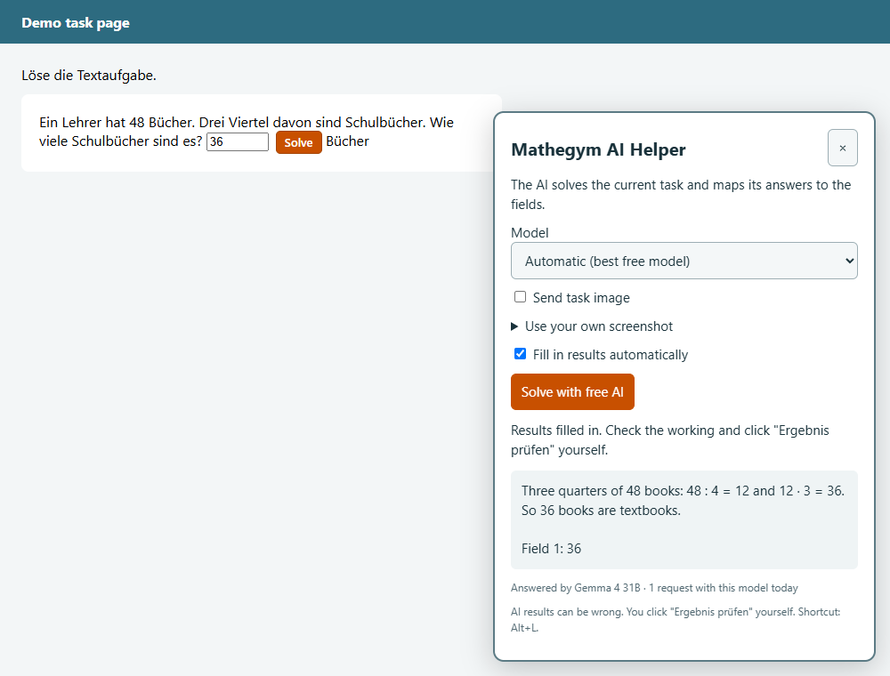
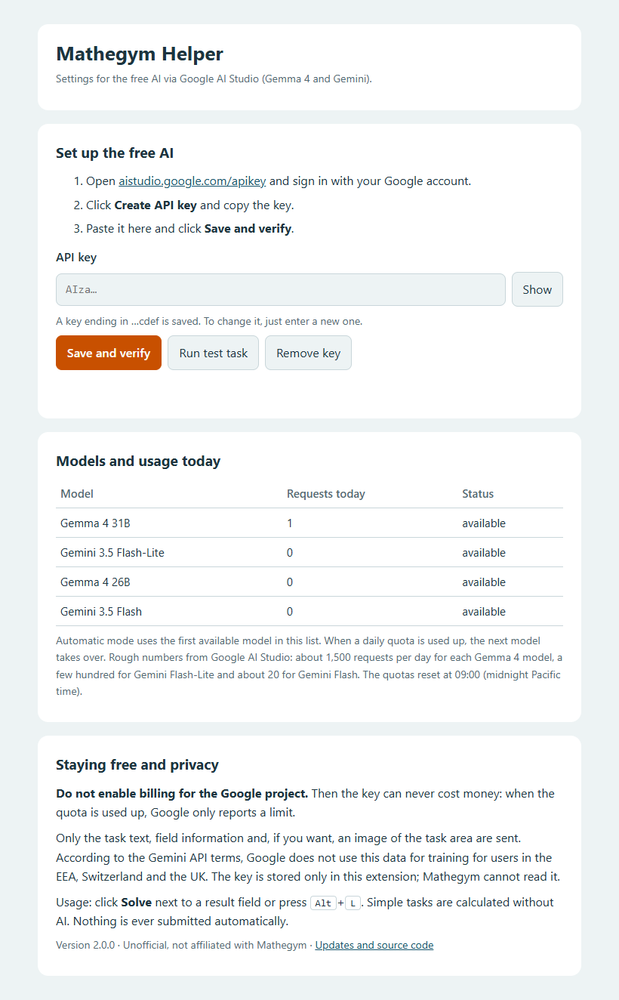

# Mathegym Helper

A Chrome/Edge extension that adds a **Solve** button next to every result field on [mathegym.de](https://mathegym.de). Simple tasks are calculated right in the browser; everything else is solved by a **free AI from Google** (Gemma 4 and Gemini via Google AI Studio). Nothing is ever submitted automatically: you check the working and click "Ergebnis prüfen" yourself.

> **Unofficial project.** Not affiliated with or endorsed by Mathegym. AI answers can be wrong.

<p align="center"></p>

## Download

**[Download mathegym-helper-extension.zip](https://github.com/LeoAppleCool/mathegym-helper/releases/latest/download/mathegym-helper-extension.zip)** (latest release, [all releases](https://github.com/LeoAppleCool/mathegym-helper/releases))

## Installation (Chrome or Edge)

1. Download the zip above and extract it (right-click → **Extract All**).
2. Open `chrome://extensions` in Chrome or `edge://extensions` in Edge.
3. Turn on **Developer mode**.
4. Click **Load unpacked** and select the extracted folder `mathegym-helper-extension`.
5. The settings page opens automatically. Add your free API key there (see below).

**Updating:** replace the folder with the new version, click **Reload** (↻) for Mathegym Helper on the extensions page and reload the Mathegym page.

## Free API key

1. Open [aistudio.google.com/apikey](https://aistudio.google.com/apikey) and sign in with your Google account. Google requires users to be 18 or older.
2. Click **Create API key** and copy the key.
3. Paste it on the settings page, click **Save and verify** and then **Run test task**.

**Do not enable billing for the Google project.** Without billing the key can never cost money: when a quota is used up, Google simply reports a limit.

<p align="center"></p>

### How it stays free

Every Google model has its own free daily quota. The helper uses the first available model and switches to the next one automatically when a quota is used up:

| Order | Model | Free requests per day (approx.) | Reads images |
|---|---|---|---|
| 1 | Gemma 4 31B | 1,500 | yes |
| 2 | Gemini Flash-Lite (newest versions) | a few hundred | yes |
| 3 | Gemma 4 26B | 1,500 | yes |
| 4 | Gemini Flash (newest versions) | about 20 | yes |

Together that is several thousand requests per day. The quotas reset at midnight Pacific time. Google no longer publishes exact free-tier limits, so these numbers are estimates; the settings page shows your usage per model. The model list is read from your key once a day, so newer free models are picked up automatically.

## Usage

- Click **Solve** next to a result field or press **Alt+L**.
- Simple tasks (fractions of quantities, mixed numbers, percentages and unit conversions) are calculated locally with exact arithmetic, without any AI.
- Everything else opens the AI panel. It shows the working, which model answered and how many requests you used today. You can pick a model, send an image of the task, use your own screenshot or fill in the results only on click.
- Answers are validated before anything is written. Unknown, duplicate or missing fields, options that do not exist and answers that arrive after the task changed are never filled in.

## Privacy

- Only the task instruction, the content of the task area, information about its result fields and, optionally, an image of the task area are sent, directly to the Google Gemini API. According to the [Gemini API terms](https://ai.google.dev/gemini-api/terms), Google does not use this data for training for users in the EEA, Switzerland and the UK.
- The API key is kept in the extension's own storage and used only by its background script. The scripts of the Mathegym page cannot read it.
- The local solver sends nothing. There is no tracking and no server run by this project.

## Limitations

Text fields, number fields, select fields, checkboxes and simple radio groups are supported. Drawing, drag and drop and special formula editors are not operated automatically. Not every task can be solved, and AI results can be wrong.

## Bookmarklet (without the extension)

Download `install.html` from the [latest release](https://github.com/LeoAppleCool/mathegym-helper/releases/latest), open it and drag the **Solve Mathegym** link to your bookmarks bar. With the bookmarklet the key is stored in the browser for mathegym.de, where the page's scripts can read it, so the extension is the more secure choice.

## Development

Requirements: Node.js 22 or newer and Microsoft Edge (used by the browser tests).

```bash
npm install
npm run build   # extension/, release/mathegym-helper-extension.zip, bookmarklet.txt, install.html
npm test        # builds and runs all tests against a simulated Gemini API (no real key needed)
```

| File | Purpose |
|---|---|
| `src/gemini.js` | Gemini API client: model ranking, quota tracking and automatic model switching |
| `src/background.js` | Background script of the extension; keeps the API key away from the page |
| `src/options.html`, `src/options.js` | Settings page |
| `src/ai-panel.js` | AI panel on the page; reads the task and fills in validated answers |
| `src/local-solver.js` | Exact local solver for simple tasks |
| `src/field-buttons.js` | Solve buttons next to the fields and the Alt+L shortcut |
| `build.cjs` | Builds the extension, the release zip, the bookmarklet and the install page |
| `tests/` | Unit tests for the client and browser tests for the panel and the extension |

The extension ships [html2canvas](https://html2canvas.hertzen.com) 1.4.1 (MIT license) for task images; the bookmarklet loads the same file from cdnjs with an integrity hash.
